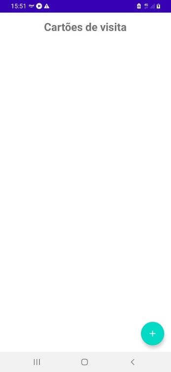
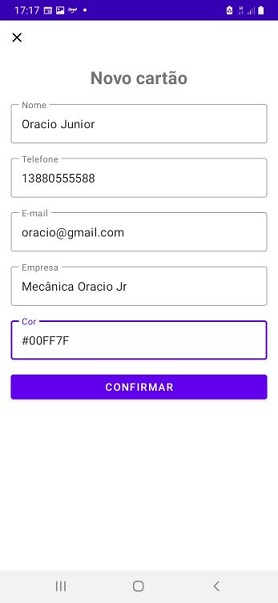
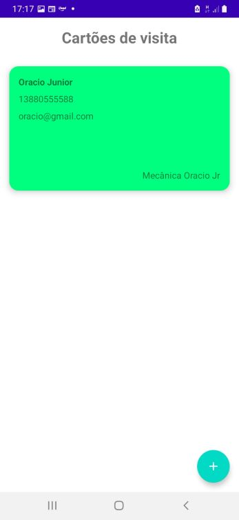

# Aplicativo Android - MOVE

  

Aplicativo Android para cadastro de cartões de visita

## Funcionalidades

Seleção de cores para os cartões e compartilhamento

## Primeiros Passos

Siga estas instruções para ter uma cópia do projeto funcionando em seu computador.

> Caso não esteja interessado no desenvolvimento, vá para a página [Releases](https://github.com/thibbatista/Cartao-de-Visitas/releases) e baixe o compilado para executar.

### Pré-requisitos

O que você precisará:

```
IDE Android Studio
Android SDK
JDK
Gradle
```

### Instalando

Siga os passos a seguir para rodar esta aplicação em seu computador.

#### Variáveis de ambiente

Informe ao Android Studio o caminho da sua SDK

```
No Windows, vá em Painel de Controle → Sistema e Segurança → Sistema → Configurações avançadas do sistema → Variáveis de Ambiente → Novo
```

Insira a variável de ambiente abaixo:

```
ANDROID_HOME = <<diretório_do_android_sdk>>
```

> Você pode ignorar esta etapa se preferir criar um arquivo local.properties dentro do diretório do projeto para especificar o valor de 'sdk.dir'

#### Obtendo uma cópia

Faça o download, use uma ferramente Git ou a própria IDE Android Studio para clonar este repositório:

```
Na tela de boas vintas do Android Studio, vá em Check out project from Version Control → Git
Informe a URI e clique em Clone, na pergunta sobre criar um projeto do Android Studio, clique em Yes
Marque Create project from existing sources e clique em Next/Yes até finalizar, mantenha as opções padrão
```

### Executando

Execute o projeto:

```
No Android Studio, clique em Run → Run 'app'
```

> A primeira execução irá demorar, pois a IDE irá montar e instalar o APK no dispositivo.

O aplicativo estará pronto quando a mensagem abaixo for exibida no Logcat:

```
move.pdsi.facom.ufu.br.move I/zygote: Compiler allocated XMB to compile void android.widget.TextView.<init>(android.content.Context, android.util.AttributeSet, int, int)
```

## Demonstração

#### Utilização

Use o menu de opções no canto superior esquerdo para navegação:

```
Vá em Meus Meios de Transporte → clique em + e cadastre um veículo
Vá em Viagens e Serviços → clique em + e registre viagens ou gastos
Vá em Estatísticas → preencha o filtro e veja o resumo das informações do aplicativo
```

#### Capturas de tela

[Demo #1](demo/demo_1.png) - [Demo #2](demo/demo_2.png) - [Demo #3](demo/demo_3.png) - [Demo #4](demo/demo_4.png) - [Demo #5](demo/demo_5.png) - [Demo #6](demo/demo_6.png) - [Demo #7](demo/demo_7.png) - [Demo #8](demo/demo_8.png) - [Demo #9](demo/demo_9.png) - [Demo #10](demo/demo_10.png)

## Deployment

Distribua este projeto como um arquivo *.apk para instalar em um dispositivo Android ou enviar para a Play Store:

```
No Android Studio, com o botão direito sobre o projeto, vá em Build → Build Bundle(s) / APK(s) → Build APK(s)
```

## Tecnologias utilizadas

* [Java](http://www.java.com) - Back-end
* [Android Studio](https://developer.android.com/studio) - IDE com SDK para desenvolvimento Android
* [Gradle](https://gradle.org/) - Sistema de automação de compilação
* [XML](https://fontawesome.com/) - Front-end

## Autores

* Steffan Martins Alves - Front-end e Activity - [LinkedIn](https://www.linkedin.com/in/steffanmartins/)
* Heitor Henrique Nunes - Testes - [LinkedIn](https://www.linkedin.com/in/heitor-nunes-7b1322176/)
* Gabriel Miranda Costa - DAO - [LinkedIn](https://www.linkedin.com/in/gabriel-miranda-costa-908b22b5/)
* Arthur Rodrigues Cruz - Model - [LinkedIn](https://www.linkedin.com/in/arthur-rodrigues-cruz/)

## Licença

Este projeto está licenciado sob a MIT License - leia [LICENSE.md](LICENSE.md) para mais detalhes.

